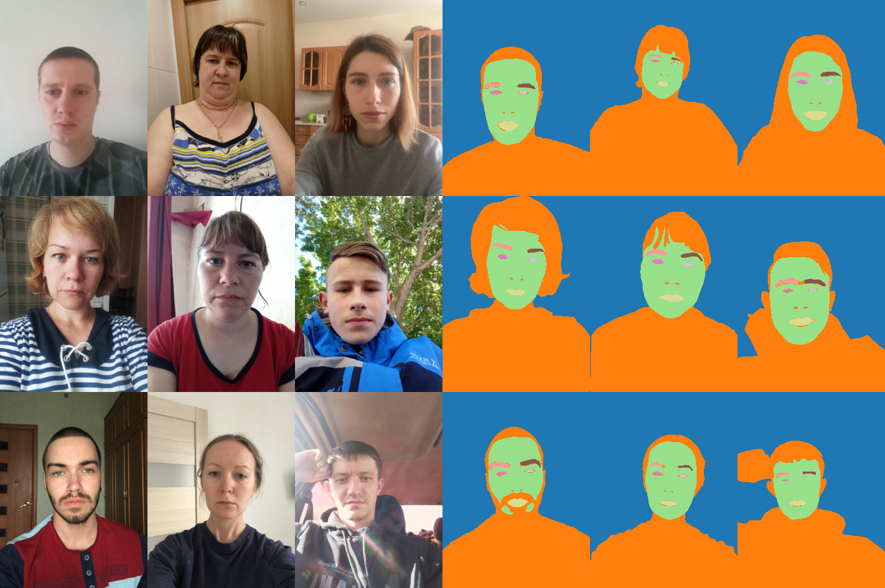
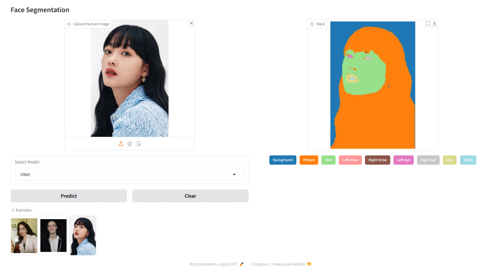
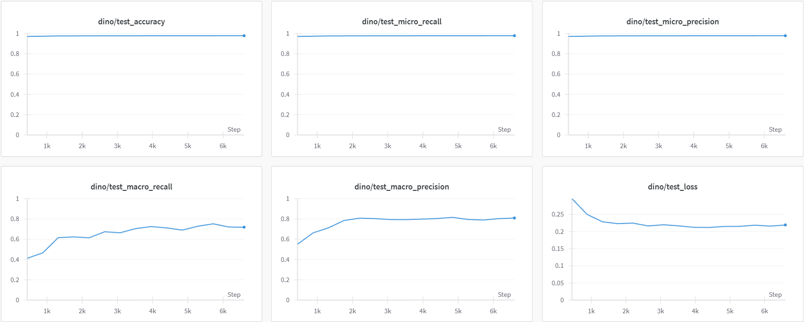
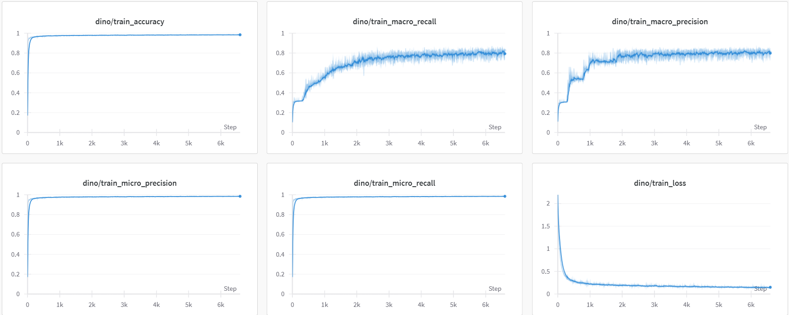
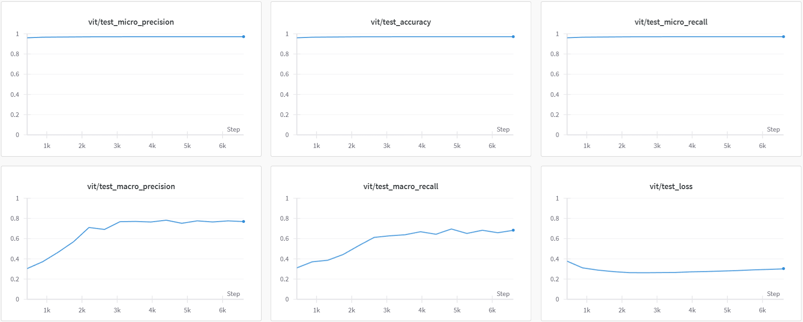
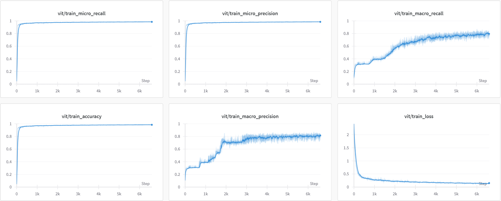
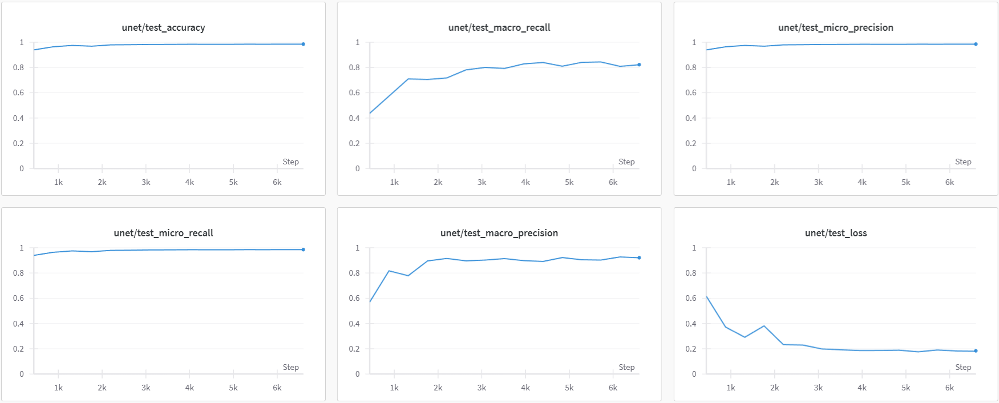
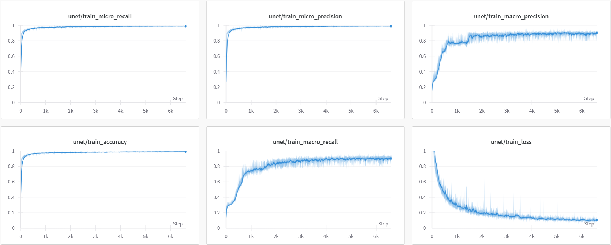

# Faces Segmentation

## Dataset Samples

Below are sample images from the dataset and their segmentation masks:



This project provides a solution for segmenting clothes into 18 categories using DINO, ViT and UNet models.

* DINO: Pretrained backbone with a segmentation head
  * https://arxiv.org/abs/2104.14294
  * https://huggingface.co/facebook/dinov2-small
* ViT: Pretrained vision transformer with a segmentation head
  * https://arxiv.org/abs/2010.11929
  * https://huggingface.co/google/vit-base-patch16-224
* UNet: Custom implementation
  * https://arxiv.org/abs/1505.04597

Gradio is used for building a web interface and Weights & Biases for experiments tracking.

## Installation

1. Clone the repository:
    ```bash
    git clone https://github.com/your-project/faces-segmentation.git
    cd faces-segmentation
    ```

2. Create and activate a virtual environment:
    ```bash
    python -m venv venv
    source venv/bin/activate
    ```

3. Install dependencies:
    ```bash
    pip install -r requirements.txt
    ```
    
4. Download the dataset (for training):
   ```bash
   python data/get_data.py
   ```

## Usage

### Training the Model
   To train a model, specify one of the following using the --model argument: **dino**, **vit** or **unet**.
   ```bash
   python src/train.py --model dino
   python src/train.py --model vit
   python src/train.py --model unet
   ```

   You can also adjust other parameters, such as the number of epochs, batch size, and learning rate, by adding additional arguments. For example:
   ```bash
   python src/train.py --model unet --num-epochs 20 --batch-size 16 --learning-rate 0.001
   ```

### Launching the Gradio Interface
   ```bash
   python app.py
   ```

   Once the interface is running, you can select a model, upload an image and view the segmentation mask.
   
   

   * Spaces: https://huggingface.co/spaces/eksemyashkina/faces-segmentation

   * Checkpoints: https://huggingface.co/eksemyashkina/faces-segmentation

## Results

| Model      | Test Micro Recall | Test Micro Precision | Test Macro Precision | Test Macro Recall | Test Accuracy | Test Loss | Train Micro Recall | Train Micro Precision | Train Macro Precision | Train Macro Recall | Train Accuracy | Train Loss |
|------------|-------------------|----------------------|-----------------------|-------------------|---------------|-----------|--------------------|-----------------------|-----------------------|--------------------|----------------|------------|
| DINO       | 0.97807          | 0.97807             | 0.8089               | 0.71867          | 0.97807       | 0.21939   | 0.98326            | 0.98326              | 0.81046              | 0.82705           | 0.98326        | 0.1552     |
| ViT        | 0.97164          | 0.97164             | 0.76978              | 0.68369          | 0.97164       | 0.30363   | 0.98283            | 0.98283              | 0.79733              | 0.77106           | 0.98283        | 0.16442    |
| UNet       | 0.98521          | 0.98521             | 0.92086              | 0.82245          | 0.98521       | 0.18393   | 0.98901            | 0.98901              | 0.91451              | 0.92519           | 0.98901        | 0.10622    |

### Training and Validation Logs for DINO





### Training and Validation Logs for ViT





### Training and Validation Logs for UNet



